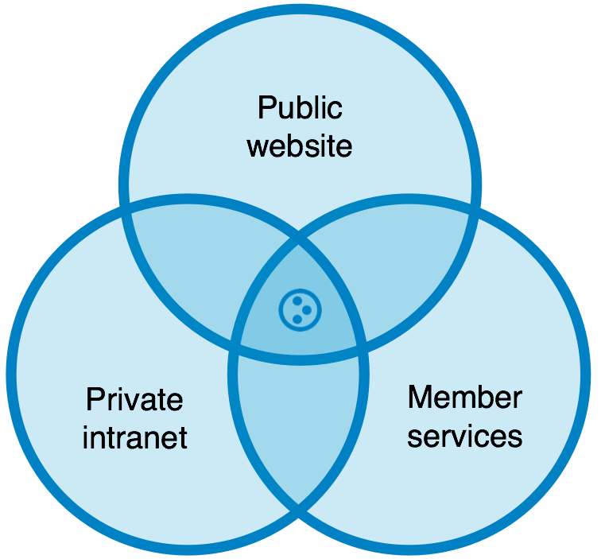
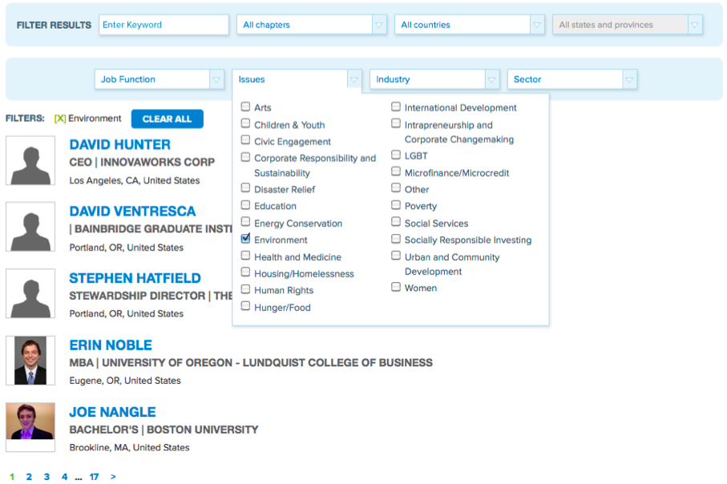
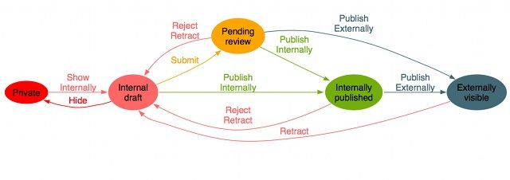
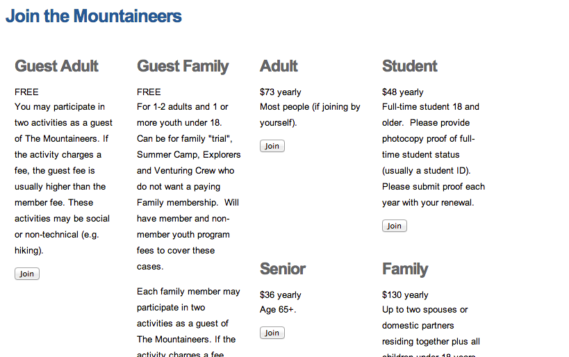
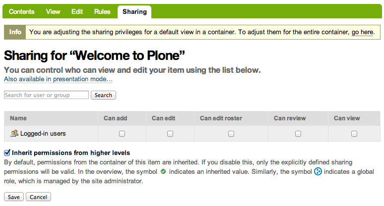
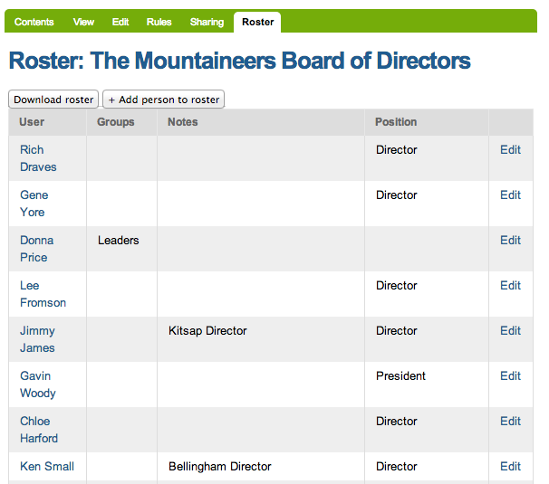
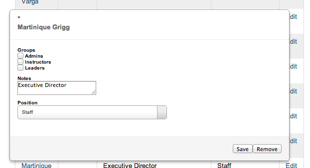

:title: Beyond the Sharing Tab: Modeling Teams of People in Plone
:data-transition-duration: 300
:css: slideshow.css

----

Beyond the Sharing Tab
======================

Modeling Teams of People in Plone
---------------------------------

|

David Glick
-----------

Plone Conference 2013
~~~~~~~~~~~~~~~~~~~~~

----

.. note::

	- Plone's a jack of all trades. Good at lots of kinds of sites.
	- Tagline: content, collaboration, community
    - another way of categorizing web projects, by audience
    - public website -> anonymous users
    - intranet -> priviled users / staff
    - member services -> providing tools for identified, non-privileged users
    - Plone can build a site that does all of these

----

Authentication:
===============

Who are the users?
------------------

.. note::

    - external vs internal member db

----

External member database
========================

LDAP
  plone.app.ldap
SQL
  pas.plugins.sqlalchemy
Google, Facebook, Twitter, etc.
  plonesocial.auth.rpx
from web server
  Products.WebServerAuth

.. note::

	Pros:
	  - Integration with existing user db.
	  - Store properties externally or in Plone

	Cons:
	  - Takes some care to avoid performance problems
	  - Missing the full benefits of in-Plone content:
	    forms, workflow, searching

----

External PAS Plugins
====================

Common culprits for performance problems
----------------------------------------

* bad enumerateUsers implementation
* need to turn on "many users" / "many groups"

.. note::

	- If the backend doesn't support searching by email or fullname,
	  make sure enumerateUsers will ignore queries using those fields
	- Many users & groups settings prevent the users control panel
	  from trying to list users before you search.

----

In-Plone member database
========================

* Standard Plone users
* dexterity.membrane

.. note::

	standard:

	- pretty lightweight, BTree for auth, another for properties
	- developer can customize, but is hard to figure out

	dexterity.membrane

	- lets a Dexterity content type act as a member
	  as long as it has a few key fields

    Pros:

    - everything in one place
    - all the features of Plone content

    Cons:

    - lack of integration
    - d.m can bloat your site if you have a lot of users

----

The membrane catalog
====================

.. note::

	- There is a problem with dexterity.membrane that can be solved.
	- Second catalog duplicates indexes, slows edits.
	- I'd really like to see something that provided a similar
	  interface to membrane, but used the main catalog.

----

Member directory
================

----

Authorization:
==============

What can the users do?
----------------------

----

The Member role
===============

By default:

* Granted to all users
* Doesn't grant many permissions

.. note::

	- As a result, it's not terribly useful out of the box.

----

The intranet workflow
=====================

.. note::

	- Like standard workflow, but allows publishing internally
	  (to users with the Member role) or externally.
	- May want to change initial state to 'private'.

----

Member levels
=============

i.e. trial, free member, premium member, lifetime member

1. Protect UI elements with permissions
2. Assign permissions to roles (i.e. Anonymous, Member, PremiumMember)
3. Grant those roles to the right users

.. note::

	- This approach makes it really easy to change who has access
	  when the client asks for it.
	- Will cover how to grant the roles in a minute...

----

UI for member levels
====================

* Select your member level
* Pay for membership
* Renewal
* Upgrade/downgrade level

.. note::

	- Using multiple member levels implies a bunch of UI that Plone
	  doesn't have out of the box.
	- Also custom business logic (i.e. what happens when downgrading)

----

----

Member states
=============

* Pending
* Active
* Grace Period
* Lapsed

.. note::

	- Can be modeled with workflow
	- Then need a cron job to update state each day
	- Or can grant automatically...

----

Granting site-wide roles
========================

* Manually with the Users/Groups control panel
* Automatically with membrane adapters (dexterity.membrane)
* Automatically with custom PAS plugin

----

What about "placeful" access control?
=====================================

Use cases:

* Private area for a committee
* Private area for participants in a course or activity
* Paid download of content

.. note::

   - Has been solved in many different ways over the years.
     Teamspace, borg.project, etc.

----

The classic approach: Sharing with groups
=========================================

.. note::

	- Plone lets you put users in groups.
	- The sharing tab lets you grant a role to a group in a particular location.

	So the recipe is:

	- Leave something private (i.e. minimum access)
	- Grant the Reader role ("Can view") to a group of people
	- Edit the group via the Users/Groups control panel

	Cons:

	- Doesn't provide a way to *delegate* control over the group
	  (because users must be admins to access the Groups control panel)
	- Requires setting things correctly in several different places
	- Too easy to accidentally publish

----

collective.local.*
==================

.. image:: local.png

.. note::

	- collective.local.adduser and collective.local.addgroup
	- They solve the delegation problem by adding to the sharing tab UI

	Still some things missing:

	- Storing metadata about someone's association with a content item.
	- Looking up which content items a person is associated with.

----

collective.workspace
====================

.. note::

   - I've been developing a new add-on to help with this use case: collective.workspace
   - Behavior that can enable a Roster tab for any Dexterity content type

----

collective.workspace
====================

.. note::

	- Can edit each roster membership.

----

collective.workspace
====================

.. image:: workspace_sharing.png

.. note::

 	- Automatically creates a member and admin group for each roster-enabled item.
 	- Shows up on sharing tab, but is not editable. Doesn't show up in site control panel.
	- Other features:
	- Can be extended with more groups, custom fields
	- Indexes roster members so you can look up where a user is a member.

----

collective.workspace TODO
=========================

- ALPHA alert!
- Easier configuration
- More features?
- Feedback welcome

.. note::

	- Needs tests, docs, release
	- Configuring is currently a developer task, not a control panel
	- Possible features: invitations, workflow policy

----

What if the user is logged in but doesn't have access?
======================================================

.. note::

   - Standard Plone: "Insufficient privileges"

   - Upsell: Show the user info about what they were trying to access,
     why they can't, and what they have to do to get there.

   - Registration upsell:
     Make registration more obvious on the login form!

   - Unfortunately, these are a bit tricky to implement currently.

----

Enhanced user profile
=====================

* Show on login
* Multiple pages?
* Summarize activity
* Contact info
* Manage subscriptions
* Privacy settings

----

Special notices
===============

* Renewal alerts
* Promos

.. note:

   - Mention plone social for providing activity streams

----

Hiding the edit bar
===================

.. note::

	- Sometimes it's necessary to make the Plone UI less confusing
	  for users who haven't been trained in Plone.
	- Can customize the actions viewlet and add a permission check.

----

Caching
=======

* Serve authenticated traffic on a different domain, if possible.
* Consider varying on role rather than user

.. note::

	- Describe split-view problem
	- Serve traffic on a different domain, if possible
	- Changing to vary by role:
		- remove user-specific content
		- or load separately (js or esi)

----

Where is the integrated product?
================================

.. note::

	- There's a gap in the Plone add-on ecosystem;
	  we need one that handles these use cases.
	- Good UI for both users and admins.

----

Questions?
==========

Email
  david@glicksoftware.com
IRC
  davisagli
