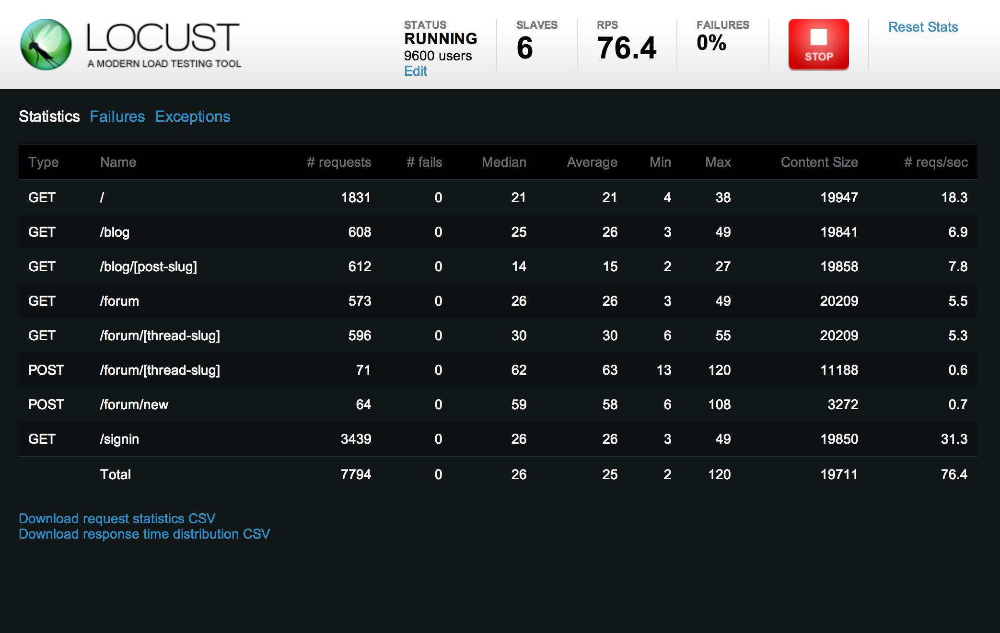

:title: Greater than the sum of the parts
:data-transition-duration: 300
:data-width: 1200
:css: slideshow.css

----

Greater than the sum of the parts
=================================

Lessons from integrating Pyramid, React, and Plone

(and elasticsearch, and Salesforce, and a payment gateway, and...)

|

David Glick
-----------

Plone Conference 2016, Boston
~~~~~~~~~~~~~~~~~~~~~~~~~~~~~

.. note::

    - I'm David Glick. I've been a part of the Plone community for 9 years
      and am currently doing freelance work with Jazkarta and OddBird.

----

.. note::

    This is a talk about things we learned while building
    a Volunteer Management System
    for the Washington Trails Association.

    WTA is a large nonprofit in Washington state
    which maintains trails, advocates for their protection, and promotes hiking.
    They are celebrating their 50th anniversary this year.

    The project was a partnership between Jazkarta and Percolator Consulting.

----

Complexity
==========

.. image:: images/legocar.jpg
   :class: right

.. note::

    This is a talk about building a complex system out of smaller parts.
    I titled the talk "greater than the sum of the parts"
    which makes it sound like this is a clear win.
    You take a bunch of run-of-the-mill pieces and end up with something magical.
    But in reality, there are tradeoffs...

    A simple system is like the toy car on the left:
    unified, straightforward, easier to test and reason about.
    But There's Only One Way To Do It, not very flexible.

    A complex system is more like the lego car: flexible, not locked in.
    More potential for failure OR success,
    and it can be a puzzle to put it together.

----

The tools matter
================

.. image:: images/plone.png
   :class: left

.. image:: images/react_logo.png
   :class: right

.. note::

    Part of the thesis of this talk is also that the tools matter.

    The choices we make about tools have an impact on how successful we are
    and on how much fun we have using them.

    So while I said "greater than the sum of the parts",
    the point is that even though building something complex
    is inevitably painful, using really good parts can help
    make up for that.

    That also means this is a talk for developers.
    I'm going to talk about the architecture we used,
    and then I'm going to show off Pyramid and React
    and talk about how they were a good fit for the project.

----

:class: full

.. image:: images/wta.org.png

.. note::

    This is the WTA website, built in Plone.

    It's a very popular resource for hikers in Washington state.
    They can search for hikes by different characteristics,
    save hikes they've completed, and add trip reports.

----

wta.org + Salesforce + vols.wta.org
===================================

.. raw:: html
    :file: images/sites.svg

.. note::

    But that's just part of their technology. Before this project, WTA's stack included:
    - wta.org
    - A Salesforce instance, used by staff to track donors, members, volunteers, etc.
    - A Volunteer Management System (VMS) which was a decade-old pile of Perl scripts.

    You can guess which part they wanted to replace.

----

:class: wide

Find a Work Party
=================

.. image:: images/search_list.png
    :class: left

.. image:: images/search_map.png
    :class: right

.. note::

    Now let me show you the system we built to replace the VMS.

    Volunteers can do faceted search for upcoming work parties,
    and view the results as a list, a map, or a calendar.

----

Registration
============

.. image:: images/register_1.png
    :class: left

.. image:: images/register_2.png
    :class: right

.. note::

    The system handles registration. You can sign up yourself
    and your friends or family, enter whether you want to carpool,
    and create an account for wta.org. It handles payment and sends
    notifications.

----

:class: wide

Crew Leader Tools
=================

.. image:: images/crew_message_board.png
    :class: right

.. note::

    There are also tools for the leaders of volunteer crews.
    Crew leaders can view a roster of who is attending and their
    skills and level of experience. And they can send messages
    to the crew.

----

Reports
=======

.. image:: images/summary_reports.png

.. note::

    Crew leaders, WTA staff and the organizations that manage public lands
    can also access reports of work that was completed.

----

Which tool?
===========

.. image:: images/plone.png
   :class: left

.. image:: images/react_logo.png
   :class: right

.. note::

    So the big question was what technology to use.

    Building the entire thing in Salesforce was an option:
      - but as a completely hosted environment, can be awkward for rapid development of polished UI
      - license restrictions mean there's a cost to giving everyone access to it

    Plone also would have been a natural choice:
      - The users are already here
      - But VMS wasn't going to benefit a lot from Plone's content-centric features,
        and there's overhead to building on top of a large system.

----

Architecture
============

.. raw:: html
    :file: images/architecture.svg

.. note::
    
    This is the architecture we chose. VMS (left) is separate from the website (right).

    - Salesforce
        - main data store
        - primary UI for staff entering work parties
    - Pyramid app
        - controls access to records
        - provides faceted search using elasticsearch
        - polished UI for volunteers (ReactJS)
    - Plone
        - authentication
        - user profile ("My Backpack")

----

.. note::

    Let's talk about what I like about Pyramid.

----

View configuration
==================

.. code:: python

    from pyramid.view import view_config

    @view_config(
        context=WorkParty, name='register',
        renderer='register.pt')
    def register_form(context, request):
        # ...

    @view_config(
        context=WorkParty, name='register',
        request_method='POST', check_csrf=True, permission=True)
    def register(context, request):
        # ...

.. note::

    A lot of the app was building JSON endpoints for the React frontend
    to interact with. I won't call it REST because it was more RPC-style.

    Pyramid's view configuration is nice because you can use whatever you
    want to determine if the view matches. Here we have two views with the
    same context and name, but one only matches POST requests for when the
    form is submitted.

    I like using the ``view_config`` decorator because it keeps view
    configuration next to the code.

----

No globals
==========

.. code:: python
   :name: __init__.py

    def main(global_config, **local_config):
        config = Configurator(settings=global_config)
        config.scan('.views')
        return config.make_wsgi_app()

.. note::

    But unlike some microframeworks, Pyramid is careful to avoid storing
    things in globals, which is good because it makes it possible to
    test part of the system or run multiple copies of the app in the same
    process.

    The view_config decorator we just saw stores some metadata,
    but doesn't actually register the view.
    That doesn't happen until our entry point creates a Configurator
    and scans the views module.

----

Testable views
==============

.. code:: python

    @view_config(name='register', renderer='json')
    def register(context, request):
        return {
            'title': 'Register'
        }

.. note::

    Avoiding globals isn't the only thing that makes Pyramid testable.
    Its views are also designed to return a Python dictionary rather
    than an HTTP response, so it's easier to make assertions.

    Each view can have a renderer which takes care of turning the dict
    into the response in a particular format.

----

:class: centered

Runs on Python 3
================

.. note ::

    Of course, Pyramid ticks off a few boxes: it runs on Python 3...

----

:class: centered

Thorough documentation
======================

.. note::

    ...and has thorough documentation, including tutorials,
    narrative docs, and reference material.

----

:class: centered

The framework for frameworks
============================

.. note::

    For a project like this where we're integrating
    multiple services, we really benefit from 
    Pyramid's tools for framework building.

----

Request properties
==================

Example: Access Salesforce client on request

.. code:: python

    # In config:

    client = SalesforceClient(settings)

    def find_salesforce_client(request):
        return client

    config.add_request_method(
        find_salesforce_client, 'salesforce', reify=True)

    # Now we can get the Salesforce client from any view using:
    request.salesforce

.. note::

    One of those is request properties, which make it easy
    to attach your own tools to the request, for easy access anywhere.

    Here in config code we set up a Salesforce client and
    a function that returns it. We then add that as a request method.
    And now we can use request.salesforce.

----

Tweens
======

Example: Handle SSO param in any request

.. code:: python

    def sso_tween_factory(handler, registry):
        def sso_tween(request):
            if 'sso' in request.GET:
                # handle single sign-on...
            return handler(request)
        return security_tween

    # in config:
    config.add_tween(
        'vms.auth.sso_tween_factory', under=pyramid.tweens.INGRESS
    )

.. note::

    Tweens make it possible to wrap every request and do custom handling.
    Kind of like publisher events in Zope.
    This code adds a tween that watches for a query string param called
    "sso" in each request, and if it's there it logs you in using that token.
    Otherwise it continues to normal request handling.

----

Exception views
===============

Example: Render exceptions as JSON

.. code:: python

    @view_config(
        context=Exception, accept='application/json',
        renderer='json')
    def json_exception_view(exc, request):
        logger.exception(str(exc))
        request.response.status = 500
        return {
            'code': 500,
            'title': exc.__class__.__name__,
            'detail': str(exc),
        }

.. note::

    Another thing we did is make sure exceptions render as JSON
    if the browser requested a JSON response.
    Here we register an exception view (like in Zope)
    for any exception if the request's Accept header asked for
    application/json, and return a dict with the error information.

----

Batteries available cheap
=========================

- pyramid_chameleon
- pyramid_layout
- pyramid_cachebust
- pyramid_mailer

.. note::

    Pyramid's configuration system makes it possible to have add-ons.
    These are some we used.

    - pyramid_chameleon: Chameleon templates
    - pyramid_layout: A main template with slots
    - pyramid_cachebust: Reference CSS using its last modified time
    - pyramid_mailer: Send email transactionally

----

Special deployment bonus!
=========================

Look ma, no ZODB cache...

.. note::

    - This is more a property of the app we built
      than a general benefit of pyramid, but worth noting
      for Plone developers: the small memory footprint meant
      it was easy to run a bunch of threads to handle
      concurrent submissions of the registration form.
      If we had built this in Plone we would have had trouble
      on the day registration opens, because the calls to
      Salesforce can take a second or two.

----

:class: centered

Not perfect
===========

.. note::

    Not everything is perfect in Pyramid.

    - CSRF protection isn't automatic
      (but I think Donald Stufft has done some work on that?)
    - Exception views are handled by a tween,
      so custom tweens need to be careful about error handling.
    - Some assembly required
    - Logging tricky to set up

----

:class: centered

Testing
=======

.. note::

    Pyramid is pretty agnostic as to what kind of tests you write.
    Here's what we did...

----

Unit testing:

``py.test``
===========

.. code:: python

    def workparty():
        return {'name': 'Tolt-McDonald Park'}

    def test_workparty(workparty):
        assert workparty['name'] == 'Tolt-McDonald Park'

.. note::

    We used the py.test framework. People either like or hate it.
    I like it. It's a bit magical, but keeps tests clean and concise.

    It makes it easy to define fixtures (like more granular layers),
    and automatically injects them into tests with matching argument names.
    It also adds magic to Python assertions to return more useful failure messages.

----

Building fixtures:

``factory_boy``
===============

.. code:: python

    import factory

    class WorkPartyFactory(factory.BaseDictFactory):
        name = factory.Sequence(
            lambda n: 'Test Work Party {0}'.format(n))
        start_date = factory.Faker(
            'date_time_between', start_date='+1d', end_date='+30d')
        work_party_type = factory.SubFactory(WorkPartyTypeFactory)
        status = 'Published'

.. note::

    Since the real data is in Salesforce, we needed a lot of fake
    data fixtures for writing tests. ``factory_boy`` makes it
    easy to build fake data. Here, every time this factory
    is instantiated we'll get an incrementing number, a date
    picked from a range, and a subobject using a different factory.

----

HTTP-level functional testing:

``WebTest``
===========

.. code:: python

    def test_search_view(client, indexed_wp):
        res = client.get('/workparties.json').json
        assert len(res['results']) == 1

.. note::

    For testing functionality at the HTTP level, I recommend WebTest.
    It wraps a WSGI app and provides an HTTP-like API.

----

In-browser functional testing:

``pytest-bdd`` + ``behaving``
=============================

.. code::

    @usefixtures(indexed_wp)
    Feature: Work Party page

        Scenario: Navigate to work party via search result list
            When I visit "/"
            And I click the link with text that contains "Test Work Party"
            Then I should see "JOIN WORK PARTY" within 15 seconds

.. note::

    And for tests in the browser we used pytest-bdd and behaving.
    pytest-bdd lets you write tests in this style
    (which should remind you of robotframework)
    and behaving provides a set of steps that control a browser via selenium.

----

Load testing:

locust.io
=========

.. note::

    We wanted to make sure that the system would hold up on the day
    when registration opens and many people try to sign up in the first ten minutes.
    We used a load testing tool called locust.io.
    You write simple Python code to load URLs,
    and it takes care of firing up workers and measuring how it performs.

----

.. image:: images/react_logo.png

.. note::

    Let's shift gears and talk about ReactJS.

----

React
=====

.. code::

    class Button extends React.Component {
        render () {
            return <button onClick={this.click}>{this.props.label}</button>;
        }

        click () {
            alert('clicked!');
        }
    }

    ReactDOM.render(
        <Button label="Click me!" />,
        document.getElementById('body')
    );

.. note::

    React is a system for structuring your front-end code
    into components.

    It encourages using a syntax called JSX which lets you mix
    HTML-like markup in with Javascript code.

    So here we define a "Button" component which accepts a label
    property and renders an HTML button element. It also handles
    a click event on that button. At the bottom, we tell React
    to build a Button with the label "Click me!", then render
    it to the page body.

    So, what's the appeal? The first reaction to React is often...

----

|

Ew, you got HTML in my Javascript!
==================================

|

Ew, you got Javascript in my HTML!
==================================

.. note::

    In many ways, I think this is like whitespace in Python.
    Don't worry, you'll get over it.
    And it can be nice to have your markup close to your code.

    Of course, there are times when you do have separate concerns
    (for example, you want to provide the ability to override a template,
    like we do in the Plone mockup). It would be nice if React had
    better support for this.

    And there's added complexity to compiling JSX to Javascript.
    But if you want to write ES6 you have to deal with that anyway.

    Also, because JSX compiles to Javascript,
    it has subtle differences from real HTML.
    You have to say className instead of class,
    because class is a Javascript keyword.
    And that means you can't just copy and paste
    HTML from a designer into React without some work.

    I've actually started playing around with writing a template
    engine that takes templates in Jinja2 syntax and renders them
    as a React virtual DOM.

----

:class: full

.. image:: images/react.svg

.. note::

    People get excited about how React helps frontend performance,
    and there are a bunch of complicated things you can learn about
    how to structure your components to make it even faster.

    What you need to know is: When React renders components,
    it constructs plain Javascript objects representing DOM elements.
    It then compares them to the real DOM and updates only what
    changed. This makes it fast compared to replacing all the DOM elements
    on every render.

    In most cases, this is going to be enough. You can do more
    so that React knows when it doesn't even need to bother calling your render
    function, but unless you're updating something every second
    it's probably not going to matter.

----

:class: centered

Isomorphic rendering
====================

.. note::

    React has support for "isomorphic rendering"
    which is a fancy way of saying that you can render your page
    on either the server side or client side.

    For an app with a Python backend you can write Python views
    that return JSON, and then pipe that to a Javascript process
    for rendering. (See Laurence Rowe's subprocess-middleware.)

    This can be important for a public-facing, content-centric site
    to make sure it can be easily indexed.
    (Google tries to index client-side rendered pages,
    but it's not always successful, and it's not the only search engine.)

    But for a site with private pages, it's not worth the effort.

----

:class: centered

Focus on what is displayed, not how
===================================

.. note::

    As far as I'm concerned, the big win with React is that it's declarative.
    There is a clear representation of the state of the application,
    and when you update that state it will take care of automatically
    and efficiently updating where that state is reflected
    in the rendered page.

    For me this is a revelation almost as momentous as when I
    learned how to use jquery selectors.

----

JQuery:

Imperative counterexample
=========================

.. code:: javascript

    var $form = $('form');
    var $checkbox = $('#my-checkbox');
    var $section = $('#my-form-section');
    var update_form = function () {
        $section.toggleClass('on', $checkbox.prop('checked'));
    };
    $('input,select', $form).click(update_form);
    update_form();

.. note::

    I can't count how many times I've written code like this with jquery.
    It's a mess.
    We declare an "update_form" function
    which checks the state of a checkbox
    and toggles a section of the form.
    Then we make sure update_form runs when the checkbox is clicked.
    Then we run it to make sure things are updated when the page loads.

    There's no central place where we keep track of the state of the app,
    and that makes it hard to keep track of what needs to be updated when.

    With React, we would make clicking the checkbox update the state of the form,
    and the section component based on that form state would automatically re-render.

    Of course, React isn't the only frontend framework that supports
    automatic data binding. If you've got one you like, I'm not sure
    it's worth switching to React. But if you've got performance problems,
    or are starting something new, React is worth considering.

----

Giving React partial control
============================

.. code:: html

    

.. note::

    I'm going to shift gears and talk about
    how we made the React frontend work along with the Pyramid backend.

    React is often used in the context of a single-page app
    where it is responsible for rendering the entire page.

    But we had cases where we only wanted to render certain
    pieces using React components. (The work party view,
    for example.)

    We used this pattern for inserting React components
    declaratively without needing to invoke the ReactDOM.render
    API. There is a script which scans for the data-component divs
    and renders the component into them.

    The props are built as a dict in Python,
    then rendered to JSON to be inserted in the `data-props`
    attribute in a chameleon template.

    Looks like a pattern, right?

----

:class: centered

Accessing the session
=====================

.. note::

    We had cases where our frontend components needed to know
    something about the current user.

    By default Pyramid stores sessions in a signed cookie.
    When a user logs in we store some user info in the session.
    The script that loads the react components reads this info
    from the cookie and adds it to the component's props,
    so we can use ``this.props.user``.

    We aren't validating the signature, so this info can
    be tampered with by the user. So don't rely on it for access
    control; you still need to authenticate and validate your requests
    on the server side.

----

Translations
============

.. note::

    - load as JSON via AJAX
    - pass as part of ``props`` to top-level React component

----

:class: centered

Integrating with Plone
======================

.. note::

    Finally, let me talk about a few details of where the VMS system
    integrated with Plone.

----

:class: wide

Shared navigation
=================

.. note::

    To share navigation between the two sites,
    we added a browser view to the Plone site
    which returns the nav menu items as JSON.

    The VMS app then renders these items using similar markup and styles.

    This reminds me of the Javascript Plone client!

----

Cross-origin resource sharing (CORS)
====================================

- ``Access-Control-Allow-Origin``
- ``Vary: Origin``
- ``Access-Control-Allow-Credentials``
- ``withCredentials``
- ``OPTIONS``

.. note::

    When providing a JSON API for use from the client side
    on a different domain, you have to know about CORS headers.

    Use plone.rest

----

Single sign-on:

Login
=====

.. image:: images/login_flow.svg

----

Single sign-on:

Logout
======

----

Questions?
==========

Email:
    david@glicksoftware.com
Twitter/IRC:
    davisagli
Talk feedback:
    ploneconf.sixfeetup.com

.. image:: images/jazkarta_logo.png
    :class: left

.. image:: images/oddbird_logo.svg
    :class: left
