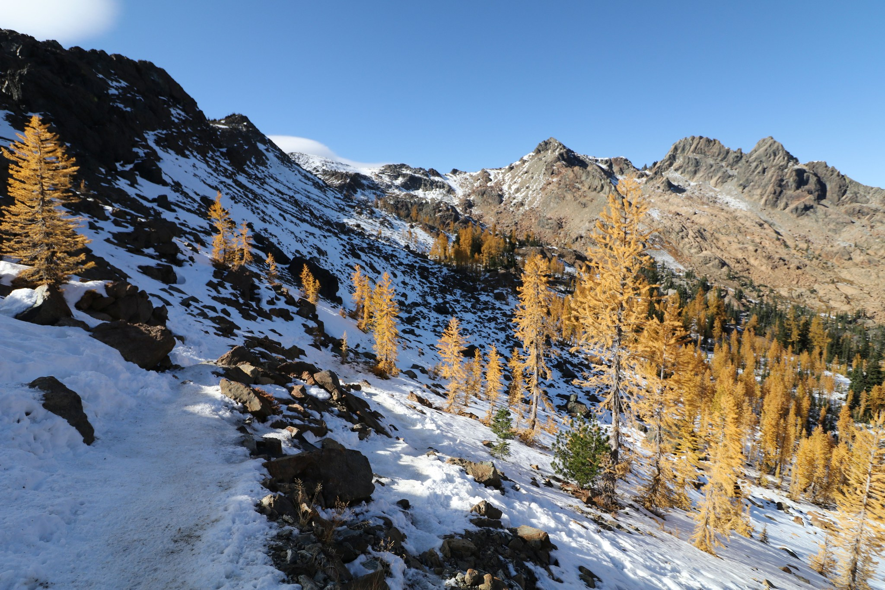

:title: Nice blobs!
:data-transition-duration: 300
:data-width: 1200
:css: slideshow.css

----

Nice blobs!
===========

It'd be a shame if anything happened to them...

|

David Glick
-----------

Plone Conference 2017, Barcelona
~~~~~~~~~~~~~~~~~~~~~~~~~~~~~~~~

.. note::

    - I'm David Glick. Celebrating my 10th Ploniversary!
      Currently doing freelance work with Jazkarta and Oddbird.

    - This is a talk about what to do when your blob storage
      gets hard to manage, and a solution we built for that
      (collective.s3blobs)

----

.. note::

    I'll be describing a solution that Jazkarta built for Washington Trails Association
    earlier this year.

    WTA is a large nonprofit in Washington state
    which maintains trails, advocates for their protection, and promotes hiking.
    They have a Plone site with a lot of images.
    Hikers can upload photos they take while hiking in Washington state.

    In spring of this year, 650GB and growing by gigabytes per day!

----

Problems
========

- Repeated downtime to resize disk volume
- Hard to keep copies of the site up to date
- Hard to keep backups

----

Requirements
============

- Move blob data to cloud storage
- Keep reasonable performance
- Don't require changes at app level
- Smooth migration path

----

Handle at app level?
====================

.. note::

    Thought about this: new field on image with S3 URL,
    celery task to move blob to S3 and update this field,
    serve from S3 when that is there.

    But then we started thinking about how images are used in Plone.
    Needs access to a file on disk for things like building image scales,
    reading image dimensions.

    Do we really want to have to customize every add-on that
    does something with images?

----

Inspiration: ZODB client cache
==============================

.. note::

    So we started looking for a ZODB-level solution.

    Right away I thought of the blob cache that already exists in ZEO
    clients when you aren't using a shared blobs directory.

    When you try to access a blob in the ZODB,
    it first checks to see if it is in a cache directory on the local disk,
    and if not it fetches it from the ZEO server over the network.
    Then opens the file that is in the cache directory.

    Even better, the size of that cache directory is limited to a configurable size.

    Maybe all we needed to do was modify this to get the blob
    from S3 if it isn't found in ZEO.

----

s3blobstorage and s3blobserver
==============================

.. note::

    As it turns out, Jim Fulton already built something like this
    when he was at Zope Corporation.

    s3blobstorage is a modified ZEO client storage
    which fetches blobs from an S3 bucket in addition to ZEO.

    But it really seems like experimental software:

    - Not much documentation
    - It requires running a separate process, s3blobserver,
      which is written in Scala!
    - The connection to s3blobserver must be configured using Zookeeper

----

Our solution: collective.s3blobs
================================

(diagram)

Zope
 <- ZODB storage: S3BlobCache
   <- ZODB
   <- blob cache
   <- S3

bin/archive-blobs
  ZODB -> S3

----

Prioritizes local storage
=========================

1. Try to load from underlying ZODB storage
2. Try to load from s3blobs cache.
3. Fetch file from S3 into blob cache

.. note::

    This is good because we're assuming that
    local access is both faster and cheaper than
    loading from S3.

----

Size-limited cache
==================

.. note::

    This is basically copied from the ZEO client cache.

    Can specify the maximum size of the cache directory
    before purging files.

    The cache is shared between multiple ZEO clients
    running on the same machine so we don't duplicate
    data.

    And we don't waste cache space on blobs that are
    already on disk.

----

Choose which blobs to move
==========================

::

    $ bin/archive-blobs -a 1 -s 2000000 -d

.. note::

    How do blobs get added to the S3 bucket? Using the archive-blobs script.

    - age > 1 day
    - size > 2 million bytes
    - destroy local copy after upload (verifies checksum)

    This gives some control for prioritizing fast local access
    against lower disk use. Newly created files are accessed locally until
    the script is run, so access for generating image scales is fast.

    It also means transition to S3 storage can be done progressively
    without downtime. Start with the largest files.

----

Configuration using `storage-wrapper`
=====================================

::

    storage-wrapper =
        %%import collective.s3blobs
        <s3blobcache>
          cache-dir ${buildout:directory}/var/blobcache
          cache-size 10000000000
          bucket-name my-blob-bucket
          %s
        </s3blobcache>

.. note::

    This is what configuration looks like in your zope2 instance
    section in buildout.

    It gets written into ZODB, and %s is replaced with the "normal"

    It also needs AWS keys which are loaded from environment variables.

    Even if you're using different cloud storage and can't use
    collective.s3blobs, the storage wrapper pattern may be
    a good model for similar solutions.

----

Wraps an underlying ZODB storage
================================

S3BlobCache -> ClientStorage (ZEO)

|

or

|

S3BlobCache -> FileStorage

.. note::

    This means that you can use it with ZEO or not.

    That can be nice for local development.
    Just point your copy of the site at the same
    blob bucket on S3 and it can fetch the images.
    It's read only

----

Successful results!
===================

.. note::

    - Moved blobs over 2MB (about 50% of disk use)
    - YMMV but my hunch that these are mostly original images that are
      not accessed frequently was correct.
    - No noticeable performance impact (but when there is a cache miss, it's slower)
    - Low cost (~$5/mo for storage and data transfer)

----

Bucket security
===============

.. note::

    Caveat time!

    - Relying somewhat on S3's durability.
    - But worried about user error,
      i.e. admin accidentally deletes the bucket via the AWS console.
    - So we added a special policy on the bucket which prevents deletion.
    - Can enable versioning on the bucket
      so there's a way to restore an individual file.

----

Backup strategies
=================

.. note::

    - Can enable mirroring to another AWS region in case there's an outage.
    - Could write script to fetch blobs from bucket to a third party system,
      but haven't done this yet.

----

Packing
=======

Needs to be implemented

.. note::

    Would be nice to have a way to clean up blobs
    from the bucket that are no longer referenced after packing
    the ZODB.

    Could keep track during pack and then delete those,
    or just list all blobs from the bucket and
    check each one to see if it can be loaded.

----

Serving directly via CloudFront CDN
===================================

Could be implemented

.. note::

    We thought about making some app-level changes to link
    directly to files on AWS instead of serving them through
    the Plone web server.

    Security considerations

    And in the end it wasn't important for WTA's use case

----

Status
======

- In stable production use, but unreleased.
- Within easy reach of a release (docs & tests)

----

Questions?
==========

Email:
    david@glicksoftware.com
Twitter/IRC:
    davisagli

