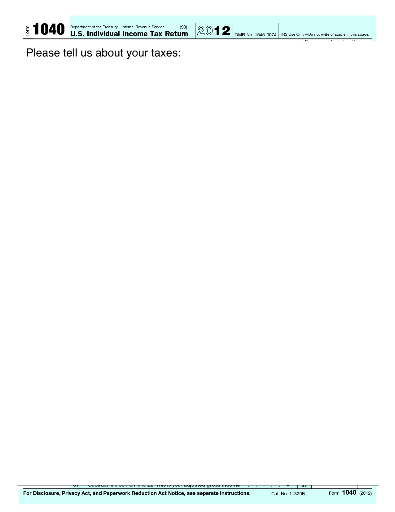
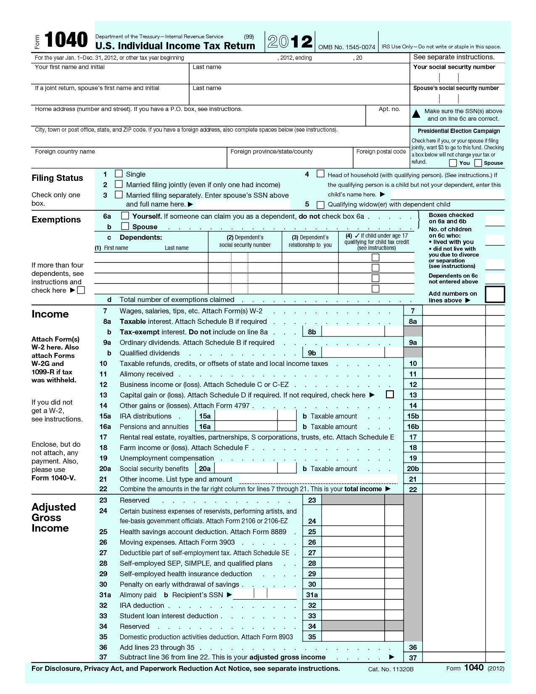
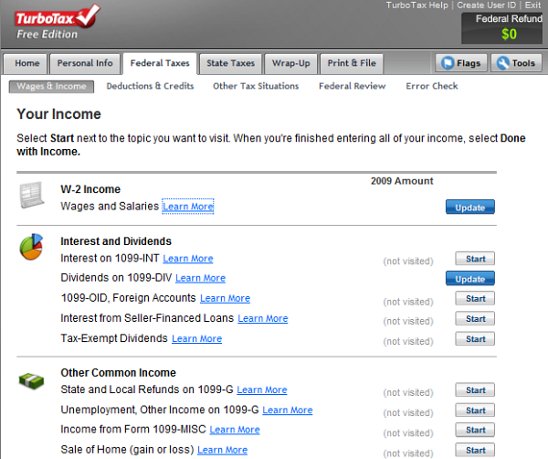
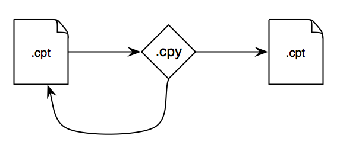
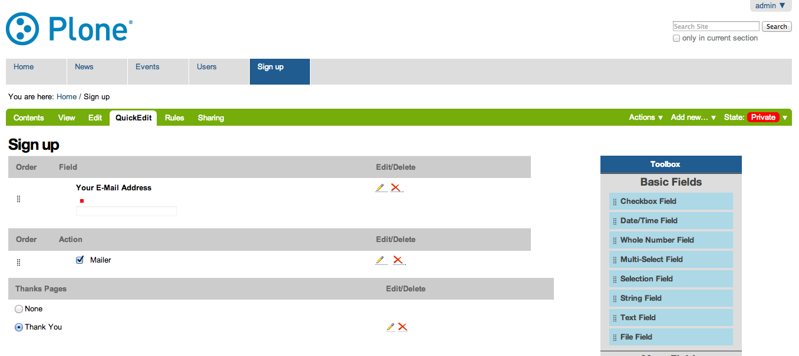
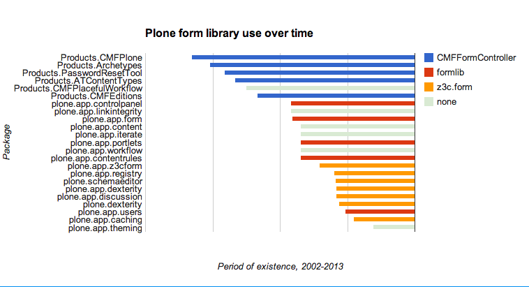

:title: Custom Plone Forms: Navigating the Labyrinth
:data-transition-duration: 300
:css: slideshow.css

----

Custom Plone Forms: Navigating the Labyrinth
============================================

|

David Glick
-----------

Plone Symposium Midwest 2013
~~~~~~~~~~~~~~~~~~~~~~~~~~~~

.. note::

    - audience
    - introduce myself

----

What is a form?
===============

Structured way of providing information

.. note::

    What is a form?

    It's a structured way of entering information.

----

|tax-1| vs. |tax-2|

.. note::

    You may recognize this...there's a reason tax forms exist.

    Forms aren't unique to the web or computers,
    but they show up a lot because computers like
    dealing with structured information.

----

What is a form?
===============

A good user experience for entering information.

.. note::

    A good form is optimized for user experience,
    not just ease of processing.

    Input controls, help text, validation, etc
    all give the user clues to help them succeed.

----

.. note::

    (turbotax example)

----

Back to the basics: HTTP
========================

.. note::

    The web is built on HTTP.

    HTTP lets a client (or browser) request a resource,
    then returns a response.

----

HTTP GET
========

.. code::

    GET /news

.. note::

    What does this do?

    HTTP GET method. Requests the news resource.

    Server should respond with the content of that page
    (or an error code).

----

Query string
============

.. code::

    GET /search?SearchableText=form+guru

.. note::

    This query searches a Plone site.

    The SearchableText parameter "form guru" is encoded as part of the URL.

----

HTTP POST
=========

.. code::

    POST /Plone/@@register

    form.fullname=David+Glick&form.username=davisagli&form.email=dglick%40gmail.com&form.password=foobar&form.password_ctl=foobar&_authenticator=1e37eda76bec66dbbb32d854d461aada6669a417&form.actions.register=Register

.. note::

    HTTP supports multiple verbs.

    The other common one is POST,
    which signifies a request that intends to make a change
    to the remote system instead of just retrieving data.

    (Have you resubmitted a form and gotten a warning from
    your browser? It knows to do that because it's using
    a POST request, and it doesn't want to make the change
    twice unless you insist.)

    This example registers a new Plone user,
    if the site has registration enabled.

    The parameters are encoded similarly to a query string,
    but they are in the body of the request, and can be
    longer.

----

HTML forms
==========

.. code:: html

    <form
      action="newsletter_signup"
      method="POST">

      <input type="email" placeholder="Email" />
      <input type="submit" value="Sign up" />

    </form>

.. raw:: html

    <form
      action="newsletter_signup"
      method="POST">

      <input type="email" placeholder="Email" />
      <input type="submit" value="Sign up" />

    </form>

.. note::

    Unfortunately, I don't have enough
    minions to delegate my manual HTTP POSTing.

    Fortunately, the HTML spec anticipated this,
    and browsers understand HTML forms.

    Here's a simple one that will POST an
    email field to the newsletter_signup URL.

    (Point out the pieces.)

    The browser automatically builds the request body.

----

Handling form input
===================

.. code:: python

    from Products.Five import BrowserView
    from Products.Five.pagetemplatefile import ViewPageTemplateFile

    class SignUpForm(BrowserView):
        template = ViewPageTemplateFile('signup_form.pt')

        def __call__(self):
            if 'form.submitted' in self.request.form:
                # (store the email here)
            return self.template()
    
.. note::

    Let's write some basic Zope-specific code that
    handles submitting this form.

    This is a Zope browser view which we're going to
    assume is registered to be accessible as newsletter_signup.

    It's a common Zope pattern to have a form that submits
    to its own URL. We determine whether it was submitted by
    looking for a 'form.submitted' token in the request.
    Where did that come from?

----

Determining whether the form was submitted
==========================================

.. code:: html
    :hl-lines: 7

    <form
      action="newsletter_signup"
      method="POST">

      <input type="email" placeholder="Email" />
      <input type="submit" value="Sign up" />
      <input type="hidden" name="form.submitted" value="1" />

    </form>

.. note::

    We add "form.submitted" as a hidden form input.

    (We could also give the submit button a name
    and check for it in the request, but then our
    check will fail if someone presses the Enter key
    instead of clicking the button.)

----

Validating input
================

.. code:: python
    :hl-lines: 4 5 7

    def __call__(self):
        errors = []
        if 'form.submitted' in self.request.form:
            if 'email' not in self.request.form:
                errors.append('Please enter your email.')

            if not errors:
                # (store the email here)
            else:
                XXX

        return self.template(errors=errors)

.. note::

    Of course, we don't want to sign up the user
    unless they actually entered an email. So we
    need to do validation of the input.

    In real life we'd also check that it's a valid
    email address!

    HTML has some support for client-side validation,
    but it's important to do server-side too,
    because you can't assume someone's using a
    well-behaved browser.

----

Displaying errors
=================

.. code:: html
    :hl-lines: 5 6 7 8

    <form
      action="newsletter_signup"
      method="POST">

      <ul tal:condition="options/errors|nothing">
        <li tal:repeat="error options/errors"
            tal:content="error" />
      </ul>
      <input type="email" placeholder="Email" />
      <input type="submit" value="Sign up" />
      <input type="hidden" name="form.submitted" value="1" />

    </form>

.. note::

    Here's some TAL that displays the errors passed into the template.

    In a real form we'd be a bit more sophisticated
    and show the error next to the field it relates to.

----

Postback
========

.. code:: html
    :hl-lines: 10

    <form
      action="newsletter_signup"
      method="POST">

      <ul tal:condition="options/errors|nothing">
        <li tal:repeat="error options/errors"
            tal:content="error" />
      </ul>
      <input type="email" placeholder="Email"
          tal:attributes="value request/form/email|nothing" />
      <input type="submit" value="Sign up" />
      <input type="hidden" name="form.submitted" value="1" />

    </form>

.. note::

    Now that submitting the form might fail with an error,
    we should make sure that the user's input is not lost.

    Here we set the value of the email field based
    on what's in the request.

----

Redirect on success
===================

.. code:: python
    :hl-lines: 9

    def __call__(self):
        errors = []
        if 'form.submitted' in self.request.form:
            if 'email' not in self.request.form:
                errors.append('Please enter your email.')

            if not errors:
                # (store the email here)
                self.request.response.redirect('thank-you')

        return self.template(errors=errors)

.. note::

    Once the user has successfully filled out the form,
    we should redirect them somewhere else.

    This makes sure that if they reload the page,
    they won't inadvertently sign up again.

----

A Menagerie of Form Libraries
=============================

    |
    |
    | “We will encourage you to develop the three great virtues of a programmer:
      laziness, impatience, and hubris.”
    |  —Larry Wall

.. note::
    Once developers have written a forms like this,
    they tend to try to find ways to avoid repeating themselves.

    Sometimes they create a library to make it easy
    to reuse these patterns. Over the years there's been a
    proliferation of these.

----

:data-rotate-y: 180

A Menagerie of Form Libraries
=============================

* CMFFormController
* Archetypes
* PloneFormGen
* Formlib
* z3c.form
* Deform
* YAFOWIL

.. note::
    And these are just the Zope-specific ones...

    Common uses:
    
    #. Render an HTML form
    #. Validate input
    #. Execute actions

----

:data-rotate-y: 0

CMFFormController
=================

.. note::
    From the through-the-web coding days of Zope.
    A basic step beyond plain templates and scripts.

    .cpt
      Controller Page Template
    .cpy
      Controller Python Script
    .vpy
      Controller Validator

    .metadata file attaches validators,
    says what to do on success, failure, or other actions

    Evaluation:
    
    * Very hackable TTW -- BUT not real Python, so tooling is hard
      (debugging, version control, etc.)
    * Not opinionated about how forms look, totally flexible -- BUT
      doesn't help with the most tedious part of form building.

----

Validators
==========

.. note::

    Responsible for doing a particular check on input
    and flagging errors.

    e.g. EmailValidator that can be associated with
    any field that's supposed to ask for an email.

    Might be for a particular field's input,
    or for the form as a whole.

----

Actions
=======

.. note::

    Some code that does things when the form is submitted.

    Often connected to a button on the form.

----

Archetypes
==========

.. code:: python

    ATDocumentSchema = ATContentTypeSchema.copy() + Schema((
        TextField('text',
            required=False,
            searchable=True,
            primary=True,
            storage=AnnotationStorage(migrate=True),
            validators=('isTidyHtmlWithCleanup',),
            default_output_type='text/x-html-safe',
            widget=RichWidget(
                description='',
                label=_(u'label_body_text',
                        default=u'Body Text'),
                rows=25,
            ),
        ),

.. note::

    The venerable content type system.

    Introduced the idea of a schema.

    Has standard edit form and view for content,
    the info about what fields to include,
    how to display them, how to validate them,
    etc. is all in the schema.

    Pros:

    * Good balance between reusability and flexibility.

    Cons:

    * Too much magic.
    * Forms must be attached to a content item.

----

Fields
======

.. note::

    A form has multiple fields; each collects a piece of information.

    A field has a type, such as a string or a date or a multiple-choice.

    A group of fields form a schema.

----

Widgets
=======

.. note::

    A particular way of presenting and/or accepting input for a field.

    Usually there's a default widget for a particular type of field
    that is well suited to that type. Such as a date picker widget for
    a date field. But they are distinct because:

    * Field type with multiple widget options, e.g. Boolean field
      might use a checkbox widget, or a radio widget with yes/no as options.
    * Widget type used with multiple field types, e.g. checkbox widget
      used with either boolean field or a multiple choice field.

----

PloneFormGen
============

.. note::
    How many of you applied the security patch from last week?

    How many of you still need to? Where's your site? ;-)

    * fantastic add-on by Steve McMahon
    * lets a non-developer build forms through the web.
    * set of common fields
    * action adapters (mailer, save data, scripts, etc.)
    * uw.pfg.d2c & workflow applications

    Evaluation:

    * Great solution for non-developers. Can easily tweak wording, etc.
    * Once you need to go beyond what it supports,
      it can be painful. (e.g. collective.megaphone)

----

:class: bigcode

Formlib
=======

.. code:: python

    from Products.CMFDefault.formlib.schema import ProxyFieldProperty
    from five.formlib.formbase import Form
    from zope.formlib import form
    from zope import schema

    class ISignup(Interface):
        email = schema.TextLine(
            title = u'Email',
            constraint = isEmail,
        )

    @implementer(ISignup)
    class SignupAdapter(object):

        def __init__(self, context):
            self.context = context

        def _get_email(self):
            return self.context.email
        def _set_email(self, value):
            self.context.email = value
        email = property(_get_email, _set_email)

    class SignupForm(Form):
        label = u'Sign up'
        form_fields = form.FormFields(ISignup)

.. note::

    From the Zope 3 community.

    Concept of data storage via schema adaptation.

    Not really flexible or mature enough.

    Example: uberselectionwidget

----

:class: bigcode

z3c.form
========

.. code:: python

    from plone.autoform.form import AutoExtensibleForm
    from z3c.form import button
    from zope import Interface

    class ISignup(Interface):
        email = schema.TextLine(
            title = u'Email',
            constraint = isEmail,
        )

    class SignupForm(AutoExtensibleForm):
        label = u'Sign up'
        schema = ISignup

        @button.buttonAndHandler(u'Sign up')
        def handleSignup(self, action):
            data, errors = self.extractForm()
            if errors:
                return

            # do signup here

            self.response.redirect('thank-you')

.. note::

    Modern form library used by the Zope community.
    Dexterity is based on it.

    Schema-driven, but doesn't look that different from
    handling a totally custom form.

    Still expects an adapter to get/set data (not shown),
    but there's a way to return an alternate context which can
    be a dict.

    Pro: Heavy use of adapter pattern makes it easy to override
    specific bits, define sitewide policy.

    Pro: Commonly used; active development of widgets

    Con: Heavy use of adapter pattern, test-based documentation
    make it hard to learn.

    Look at plone.autoform, schema-based forms manual
    on developer.plone.org.

----

Other libraries
===============

* Deform
* YAFOWIL

.. note::

    Deform:
    
    * from Pyramid ecosystem
    * uses its own schema format (colander) and serialization (peppercorn)
    * can use in Zope with collective.deform

    YAFOWIL:

    * "Yet Another Form Widget Library"
    * from BlueDynamics Alliance
    * can use in Plone with yafowil.plone

----

:class: full

.. note::

    Point out major epochs.

    Recent use of z3c.form and working on moving more stuff to it.
    Consistency is good for integrators.

----

My recommendation
=================

Learn enough about PloneFormGen and z3c.form to be dangerous

.. note::
    ...

    If you get stuck, ask questions. Sometimes there are good
    ways to do things that are not obvious.

    For example...

----

:class: bigcode

z3c.form with a custom template
===============================

signup_form.py:

.. code:: python
    :hl-lines: 4

    from Products.Five.pagetemplatefile import ViewPageTemplateFile

    class SignupForm(form.Form):
        template = ViewPageTemplateFile('templates/signup_form.pt')

templates/signup_form.pt:

.. code:: xml

    <tal:form metal:use-macro="context/@@ploneform-macros/titlelessform">
        <tal:fields metal:fill-slot="fields">

          Extra stuff before the field...

          <tal:field
          tal:replace="structure view/widgets/email/@@ploneform-render-widget" />

          ...and after.

        </tal:fields>
    </tal:form>

.. note::
    Still uses z3c.form's widgets, validation, actions.
    But can put the widgets wherever we want.

----

My recommendation
=================

Learn enough about PloneFormGen and z3c.form to be dangerous

BUT

Don't try too hard to make them work for you

.. note::
    Writing forms from scratch is not that hard!

    But let me give a few caveats...

----

Cross-site request forgery (CSRF)
=================================

If you're logged into a site,
another site can trick your browser into submitting forms
to the first site.

----

Preventing CSRF attacks
=======================

.. code:: xml

    

.. code:: python

    from plone.protect import CheckAuthenticator

    class MyForm(BrowserView):

        def __call__(self):
            CheckAuthenticator(self.request)

.. note::
    An "authenticator" token can be used to guard against CSRF.

    It is generated based on the user id and a secret key.

    If other domains try to load the page in an iframe,
    they still can't access the token due to browser
    cross-site scripting restrictions.

----

Preventing CSRF attacks, z3c.form
=================================

.. code:: python

    class MyForm(form.Form):
        enableCSRFProtection = True

.. note::
    As of recently, plone.app.z3cform has an easy way to
    enable ths for a form.

----

Dealing with character encoding
===============================

On the Python side:

.. code:: python

    name = request.form.get('name', '').decode('utf8')

Or on the XML side:

.. code:: xml

    <input type="text" name="name:utf8:ustring" />

.. note::
    Plone likes to deal witih Unicode, but form input
    comes in as UTF8-encoded strings.

    formlib and z3c.form take care of this automatically.

    If you're doing your own form make sure you test it
    with non-ASCII characters!

    Options:
    
    * Explicitly decode in Python
    * Name the HTML input so the Zope marshaller decodes it.

----

Dealing with database conflicts
===============================

* If your transaction hits a ConflictError,
  the Zope publisher will retry the request up to 3 times.

* Be aware of this if your form action calls an external service.

.. note::
    If you need to do something in a non-transactional system,
    best to call it from an after-commit hook.

----

The future of forms
===================

.. note::

    Trends:

    * Client-side rendering
    * REST webservice with JSON
    * Still need server-side validation

----

plone.app.widgets
=================

.. note::
    Effort underway to revamp Plone's widgets.

    Focusing on building functional prototypes in the "mockup" project.

    Using modern Javascript best practices.

    Compatible with Archetypes and Dexterity.

----

Questions?
==========
